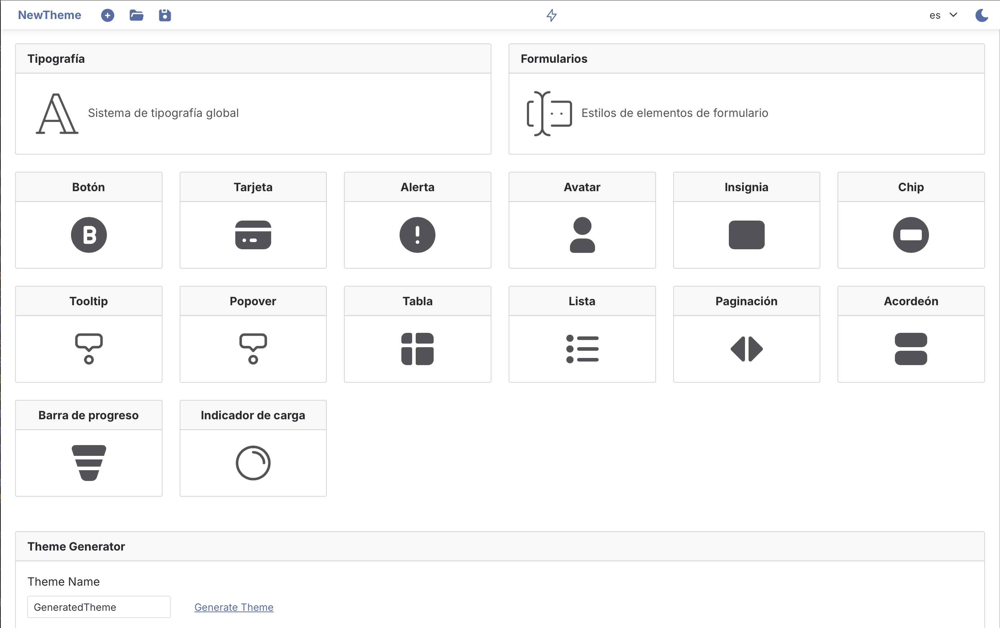
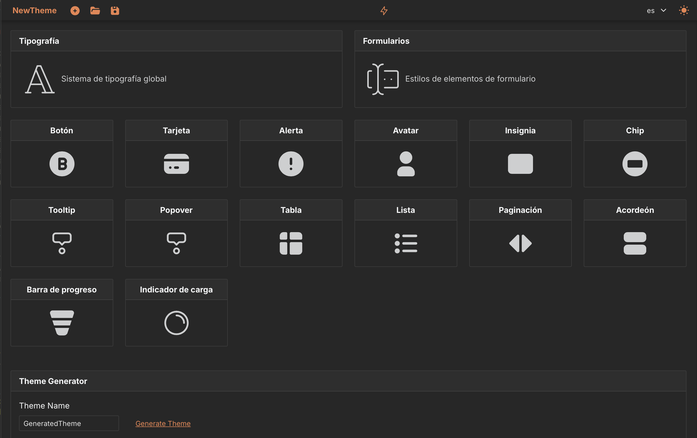
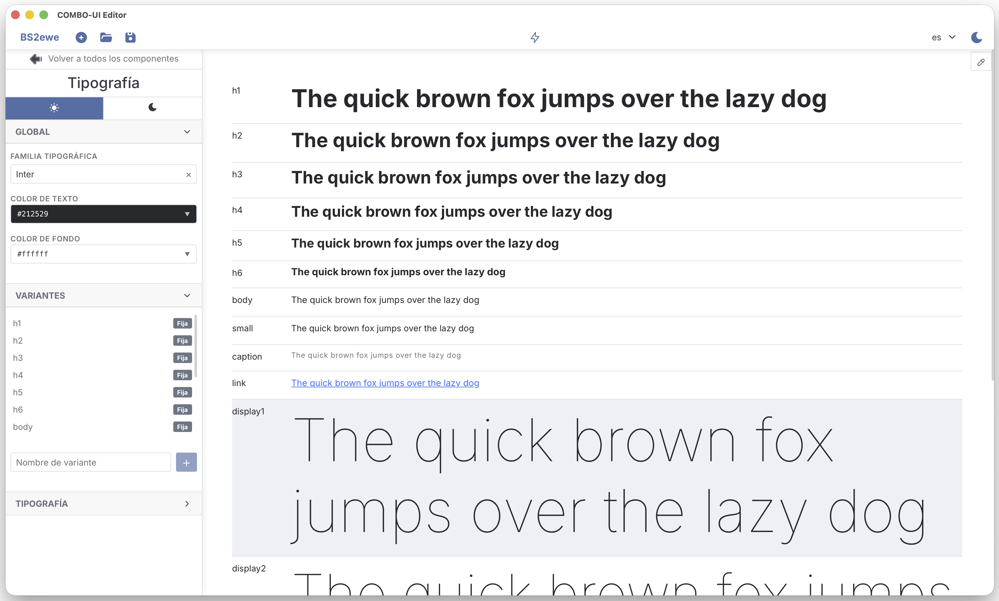
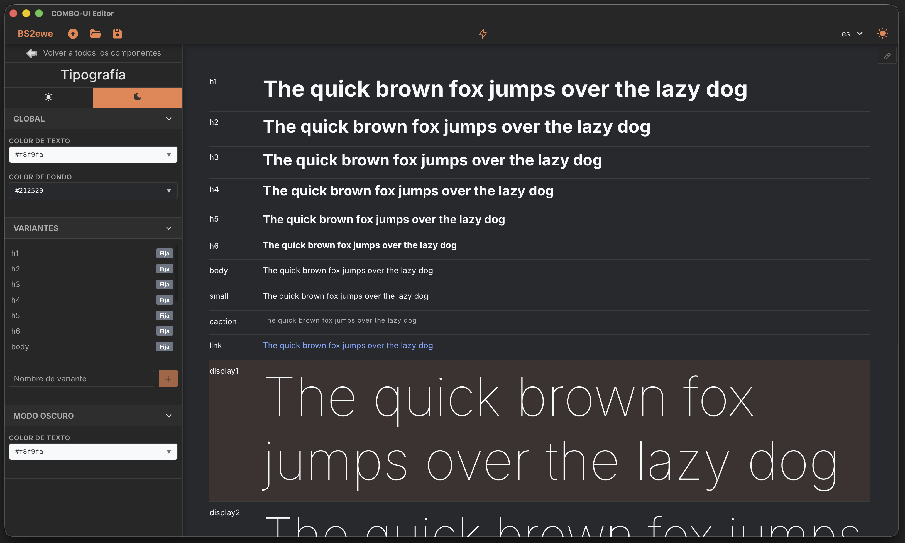

# Combo UI

   

A visual design system with a desktop theme editor, real-time sync, and framework-specific runtime packages.

Design your UI components visually, export a theme JSON, and consume it in your app. Edit live and see changes instantly via WebSocket — no page reload needed.

## How It Works

```
1. Design  — Visual editor (Tauri 2 desktop app)
2. Export  — Theme JSON (colors, typography, borders, shadows, dark mode)
3. Install — npm package for your framework
4. Build   — Use CSS classes in your templates, styles apply automatically
5. Sync    — Connect editor to your app via WebSocket for live editing
6. Ship    — Bundle the final theme JSON with your production build
```

## Repositories

| Repo                                                             | Description                                                               |
| ---------------------------------------------------------------- | ------------------------------------------------------------------------- |
| **[combo-ui](https://github.com/masweb/combo-ui)**               | Monorepo — docs, runtimes, theme sync server, themes                      |
| **[combo-ui-editor](https://github.com/masweb/combo-ui-editor)** | Visual theme editor — Tauri 2 + Vue 3 + IndexedDB                         |
| **[combo-ui-vue](https://github.com/masweb/combo-ui-vue)**       | Vue 3 runtime package — [npm](https://www.npmjs.com/package/combo-ui-vue) |

## Quick Start (Vue 3)

```bash
npm install combo-ui-vue
```

```ts
// main.ts
import { createApp } from 'vue'
import { ComboUIPlugin } from 'combo-ui-vue'
import theme from './theme.json'

const app = createApp(App)
app.use(ComboUIPlugin, {
  theme,
  darkMode: 'auto',
  ws: 'ws://localhost:3001' // optional: live sync with editor
})
```

```html
<button class="cui-button --primary">Primary</button>
<div class="cui-card --default">
  <div class="cui-card-header">Title</div>
  <div class="cui-card-body">Content</div>
</div>
```

Full API docs: [combo-ui-vue README](https://github.com/masweb/combo-ui-vue#readme)

## Live Sync

The editor connects to your app via a WebSocket relay server:

```
Editor (Tauri 2)
  │  Dexie hooks → debounced buildThemeData() → WebSocket
  ▼
theme-sync-server (port 3001)
  │  Stores theme, broadcasts to all clients
  └──► Your app → ComboUI regenerates CSS in real-time
```

Changes are debounced at 300ms. Run the server:

```bash
cd servers/theme-sync-server && npm start
```

## Supported Components

Typography, Forms, Button, Card, Alert, Avatar, Progress, Spinner, Badge, Chip, Tooltip, Popover, Table, ListGroup, Accordion, Pagination — all with unlimited variants and dark mode support.

## Tech Stack

- **Editor**: Tauri 2, Vue 3, Pinia, Dexie (IndexedDB), CoreUI, Vue I18n
- **Packages**: TypeScript, CSS Custom Properties, WebSocket
- **Build**: Vite+, pnpm workspaces, Oxlint, oxfmt
- **Server**: Node.js, ws

## Themes

Pre-built themes available in `themes/`:

- `Bootstrap.json` — Bootstrap-inspired theme with dark mode

Export your own from the editor or generate one from color pairs using the built-in theme generator.

## Demo App

A Vue 3 app showcasing every component with light/dark mode toggle. Lives in `runtimes/vue/`.

```bash
# From the monorepo root
cd runtimes/vue
pnpm install
pnpm dev
```

Components included: Button, Card, Alert, Avatar, Badge, Tooltip, Popover, Chip, Progress, Spinner, Table, ListGroup, Accordion, Pagination, Typography, Forms.

## Screenshots

**Theme Editor — Main Screen**

| Light                                                        | Dark                                                       |
| ------------------------------------------------------------ | ---------------------------------------------------------- |
|  |  |

**Typography Editor**

| Light                                                             | Dark                                                             |
| ----------------------------------------------------------------- | ---------------------------------------------------------------- |
|  |  |

## License

[MIT](LICENSE)
